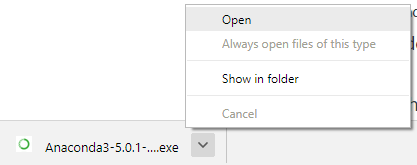

## Installing Anaconda on Windows
For problem solving with Python, I recommend installing and using the Anaconda distribution of Python.
In this section, we will run through installing the Anaconda distribution of Python on Windows 10. I think the Anaconda distribution of Python is the best option for problem solvers who want to use Python. Anaconda is free (although the download is large which can take time) and can be installed on school or work computers where you don't have administrator access or the ability to install new programs. Anaconda comes bundled with over 200 packages pre-installed including **numpy**, **matplotlib** and **jupyter**. These three packages are handy for problem solvers and will be discussed in subsequent chapters.

#### Steps:

1. Visit [Anaconda.com/downloads](https://www.anaconda.com/download/)

2. Select Windows

3. Download the .exe installer

4. Open and run the .exe installer

5. Open the Anaconda Prompt and run some Python code
#### 1. Visit the Anaconda downloads page

Go to the following link: [Anaconda.com/downloads](https://www.anaconda.com/download/)

The Anaconda Downloads Page will look something like this:


#### 2. Select Windows

Scroll down and select Windows where the three operating systems are listed.


#### 3. Download

Download the most recent Python version. At the time of this writing, the most recent version is Python 3.6. Python 2.7 is legacy Python. If you are unsure if your computer is running a 64-bit or 32-bit version of Windows, select 64-bit as that is most common.


You may be prompted to enter your email. You can still download Anaconda if you click **No Thanks** and don't enter your Work Email address.


The download is quite large (over 500 MB), so it may take a while for the download to complete.


#### 4. Open and run the installer

Once the download completes, open and run the .exe installer



At the beginning of the install you will need to click **Next** to confirm the installation


and agree to the license


At the Advanced Installation Options screen, I recommend that you **do not check** "Add Anaconda to my PATH environment variable". Do check "Register Anaconda as my default Python"


#### 5. Open the Anaconda Conda prompt from the Windows start menu

After the Anaconda installation is complete, you can go to the Windows start menu and select the Anaconda Prompt.


This will open up the **Anaconda Prompt**, which is also often called the **conda prompt**. **Anaconda** is the Python distribution and the **Anaconda Prompt** is a command line shell (a program where you type in your commands instead of using a mouse). The black screen and text that makes up the **Anaconda Prompt** don't look like much, but it is beneficial for an undergraduate engineer using Python.


At the Anaconda prompt, type ```python```. This command starts the Python Interpreter, also called the Python REPL (for Read Evaluate Print Loop). 


Note the Python version. You should see something like ```Python 3.6.1```.  With the interpreter running, you will see a set of greater-than symbols ```>>>``` before the cursor. 


Now you can type Python commands. Try typing ```import this```. You should see the **_Zen of Python_** by Tim Peters.


To close the Python interpreter, type ```exit()``` at the prompt ```>>>```.  Note the double parenthesis at the end of the ```exit()``` command. The ```()``` is needed to stop the Python interpreter and get back out to the **Anaconda Prompt**.

To close the **Anaconda Prompt**, you can either close the window with the mouse, or type ```exit```, no parenthesis necessary.
#### Congratulations! You installed the Anaconda distribution on your Windows computer!

When you want to use the Python interpreter again, click the Windows Start button, select the **Anaconda Prompt** and type ```python```.
<div class="cell border-box-sizing code_cell rendered">
<div class="input">
<div class="prompt input_prompt">In&nbsp;[&nbsp;]:</div>
<div class="inner_cell">
    <div class="input_area">
<div class=" highlight hl-ipython3"><pre><span></span> 
</pre></div>

    </div>
</div>
</div>

</div>
 

