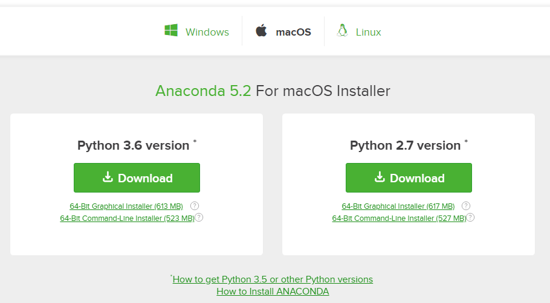

## Installing Anaconda on MacOS
In this section, we will run through installing the Anaconda distribution of Python on MacOS. MacOS comes pre-installed with legacy Python (Version 2.7). You can confirm this legacy version of Python is installed by opening the **terminal**. [command]+[Space Bar] type ```terminal```

In the MacOS Terminal type:

```
$ python
```

You will most likely see version 2.7 is installed. An issue for MacOS users is that the installed system version of Python has a set of permissions that will not always allow Python to run and may not allow Python to install external packages.  It is recommended that the **Anaconda** distribution of Python is installed in addition to the system version of Python on MacOS. You will be able to run Python code using the version of the **Anaconda** distribution of Python, and be able to install external packages on the the **Anaconda** distribution of Python.

To install the **Anaconda** distribution of Python follow the steps below:

#### Steps:

1. Visit [Anaconda.com/downloads](https://www.anaconda.com/download/)

2. Select MacOS and Download the .pkg installer

3. Open the .pkg installer

4. Follow the installation instructions

5. Source your .bash-rc file

6. Open a terminal and type ```python``` and run some code.
#### 1. Visit the Anaconda downloads page

Go to the following link: [Anaconda.com/downloads](https://www.anaconda.com/download/)

The Anaconda Downloads Page will look something like this:


#### 2. Select MacOS and download the .pkg installer

In the opperating systems box, select [MacOS]. Then download the Python 3.6 distribution .pkg installer by clicking the ** Python 3.6 * Download ** link. Python 2.7 is legacy Python. For undergraduate engineers, select the Python 3.6 version.



You may be prompted to enter your email. You can still download Anaconda if you click **No Thanks** or [x] and don't enter your Work Email address.


#### 3. Open the .pkg installer

Using the MacOS finder, navigate to the downloads folder and double click the .pkg installer file you just downloaded. It may be helpful to order your downloads by date.
#### 4. Follow the installation instructions

Follow the installation instructions. It is advised that you install **Anaconda** for the current user and that **Anaconda** **is added to your PATH**
#### 5. Source your .bash-rc file

Once Anaconda is installed, you need to load the changes to your ```PATH``` into the current terminal session.

Open the MacOS Terminal and type:
    
```
$ cd ~
$ source .bash-rc
```
#### 6. Open a terminal and type ```python``` and run some code.

Open the MacOS Terminal and type:
    
```
$ python
```

You should see something like

```
Python 3.6.3 | Anaconda Inc. |
```

At the Python REPL (the Python ```>>>``` prompt) try:

```
>>> import this
```

If you see the Zen of Python, the installation was successful. Exit out of the Python REPL using ```>>> exit()```. Make sure to include the double parenthesis ```()``` after the ```exit``` command.
 

