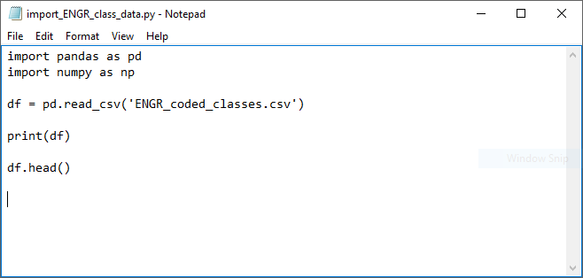
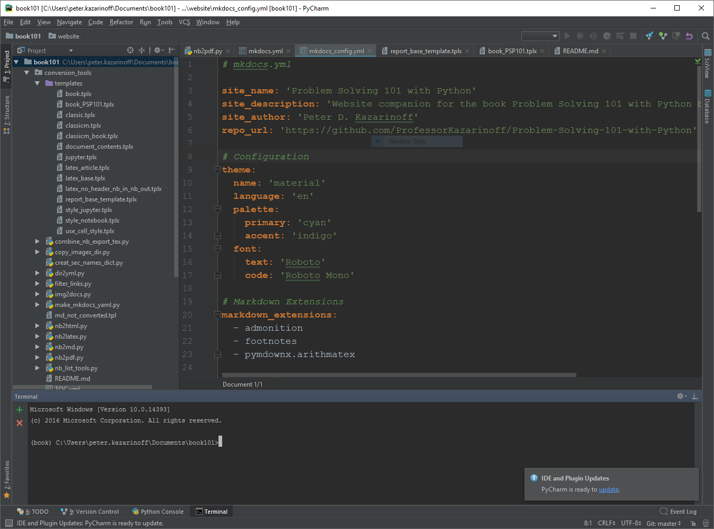
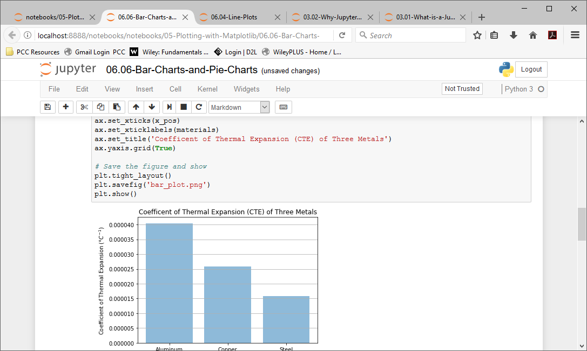

## Why Jupyter Notebooks?
 There is a vast array of editors and IDE's (Integrated Development Environments) which can edit and run Python code. Why should engineers learn to use Jupyter notebooks? 
 
 Below is a table of simple text editors and Integrated Development Environments (IDE's) that can edit and run Python code:

 | Simple Text Editors | 
 | --- |
 | Notepad |
 | Idle |
 | Vim |
 | Sublime Text |
 | Atom |
 | Nano |
 
 An example of Python code in the Notepad text editor is below:
 
 
 
 
 | IDE's |
 | --- |
 | PyCharm |
 | Visual Studio Code | 
 | Spyder |
 | Thoney |

An example of the PyCharm IDE is shown below:

 
A Jupyter Notebook is neither a simple text editor nor a full-blown IDE. Jupyter Notebooks provide a quick and streamlined way for engineers to prototype code and quickly share code.  Jupyter notebooks also provide a way for engineers to share solutions with team members, supervisors and customers.

In a way, Jupyter notebooks strike a balance between simple text editors, which are fast to start and simple and easy to manipulate, and IDE's which tend to start slower and be feature rich and complex. Simple text editors typically can only edit code, a simple text editor usually can not run code. A full IDE can edit code, run code, debug code, provide syntax highlighting and context help.
In the context of problem solving, Jupyter Notebooks make a lot of sense. They are quick to spin up and quick to provide output. Data exploration, data cleaning, and plot building can be accomplished in a Jupyter notebook easier and quicker than in a text editor or an IDE. 

In the context of sharing solutions to problems, Jupyter notebooks also make a lot of sense. Markdown cells can render text different sizes, bold and itallic. Tables and images can be insterted and plots and code output are all shown in the notebook.
 

