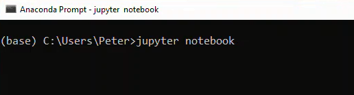
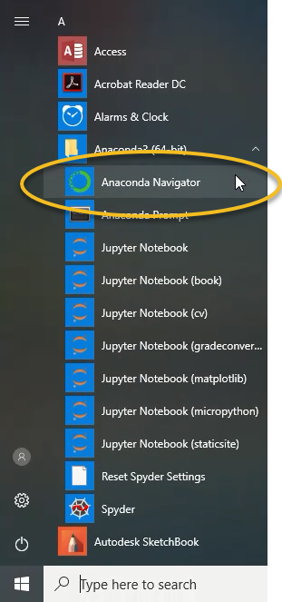

## Opening a Jupyter Notebook
In this section, we will run through how to open a _jupyter notebook_ on Windows 10 and MacOS.  Jupyter notebooks are one way problem solvers can write and execute Python code. Jupyter notebooks contain Python code, the output of that code produces when it is run and markdown cells to explain what the code means. On Windows 10, a Jupyter notebook can be started from the **Anaconda Prompt**, the Windows start menu and **Anaconda Navigator**.
#### 3 ways to open a **Jupyter notebook**:

 * Windows Start Menu

 * **Anaconda Prompt**

 * Anaconda Navigator
### Windows Start Menu
A simple way to open a **Jupyter notebook** is to use the Windows start menu. 

Open the Windows start menu and select **[Anaconda3(64 bit)]** --> **[Jupyter Notebook]**


This will open the **Jupyter file browser** in a web browser tab. 

In the upper right select **[New]** --> **[Python 3]**


A new **notebook** will open as a new tab in your web browser


To rename the **Jupyter notebook**, click the file name at the top of the page to the right of the Jupyter icon.


This will open a dialog box where the new name can be typed.


Try typing this in the first cell in the notebook to the right of the ```In [ ]:``` prompt:

```python
import this
```

Then click the run button in the middle of the menu at the top of the notebook.


### The **Anaconda Prompt**
Another method to start a new Jupyter notebook is to use the **Anaconda Prompt**.

Go to the Windows start menu and select **[Anaconda Prompt]** under **[Anaconda3]**.


If you don't see the **Anaconda Prompt** in the Windows Start Menu, then you need to install **Anaconda**. Download **Anaconda** at the following link: [Anaconda.com/downloads](https://www.anaconda.com/download/)

The **Anaconda Prompt** window should look something like:



At the **Anaconda Prompt** type:

```
> jupyter notebook
```

This will start the **jupyter notebook**. The output in the text terminal will look something like below:

```
Copy/paste this URL into your browser when you connect for the first time,
    to login with a token:
        http://localhost:8888/?token=6bdef677d3503fbb23e1b4fa0c802e ...
[I 16:14:12.661 NotebookApp] Accepting one-time-token-authenticated ...
```

A web browser should open and you should be able to see the **jupyter file browser**.


In the upper right select **[New]** --> **[Python 3]**

You will see a new tab open in your web browser. This new page is a **jupyter notebook**.


### 3. **Anaconda Navigator**
One additional way to open a **jupyter notebook** is to use **Anaconda Navigator**. Open **Anaconda Navigator** using the Windows start menu and select **[Anaconda3(64-bit)]** --> **[Anaconda Navigator]**.



An **Anaconda Navigator** will open. In the middle of the page, in the **jupyter notebook** tile, click **[Launch]**


A **jupyter file browser** will open in a web browser tab. 

In the upper right select **[New]** --> **[Python 3]**


A new **notebook** will open as a new tab in your web browser


 
### Opening a Jupyter Notebook on MacOS
To open a Jupyter notebook on MacOS, open the MacOS terminal and type:

```
$ jupyter notebook
```

If a web browser does not open, **jupyter** may not be installed. Refer to the previous section on how to install **jupyter** on MacOS. There also may be an issue using the system version of Python. A solution is to install the **Anaconda** distribution of Python or use homebrew to install Python.
### Opening a Jupyter Notebook on Linux
To open a Jupyter notebook using the Linux operating system, open a terminal and type:

```
$ jupyter notebook
```

If a web browser does not open, copy the URL listed in the terminal (when Jupyter starts) into a browser window.
<div class="cell border-box-sizing code_cell rendered">
<div class="input">
<div class="prompt input_prompt">In&nbsp;[&nbsp;]:</div>
<div class="inner_cell">
    <div class="input_area">
<div class=" highlight hl-ipython3"><pre><span></span> 
</pre></div>

    </div>
</div>
</div>

</div>
 

