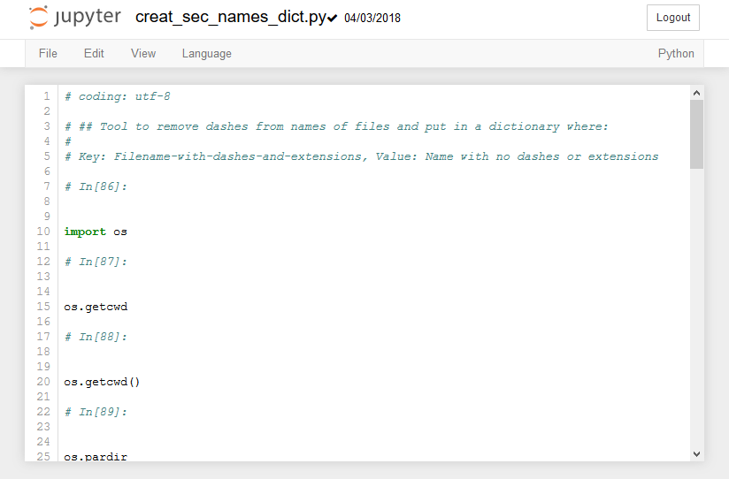

## The Jupyter Notebook Interface

When a new notebook opens, you will see the Jupter Notebook interface. Accross the top of the notebook will the the Jupyter icon and the Notebook name. You can click in the notebook name field and change the name of the notebook. Note that the file extension ```.ipynb``` is not printed in the file name field, but if you look in the Home tab, you will see that the notebook is saved with the ```.ipynb``` extension.
### Menus and Buttons

A jupyter notebook is comprised of a bunch of cells which are arrayed one after another in boxes below the menu items and buttons. There are two main types of cells: Markdown cells and Code cells.
### Code Cells

In code cells you can type Python Code and see the output. An example of a code cell is shown below. Note that the code cell has an the text ```In[ ]``` to the left of it. 

To run the code in a code cell push the [Run] button or type [Shift]+[Enter]
###  Markdown Cells

In markdown cells you can type text and headings. Markdown cells are used for documentation and explaining your code. The text in a markdown cell is not executed. Markdown cells can be formatted with a few special characters

```# H1 Heading```

 > # H1 Heading
 
```## H2 Heading```

 > ## H2 Heading
 
```### H3 Heading```

 > ### H3 Heading
 
 
```#### H4 Heading```

 > #### H4 Heading
 
 
Inline code blocks (use the \` left qutoe character, the character to the left of one, and above tab on most keyboards)
 
 > ```Inline code blocks```
 
 
  \`\`\`
  
  Seperated code blocks
  
  \`\`\`
  
  > ```
    Seperated code blocks
    ```
### Saving Jupyter Notebooks in Other Formats

Jupyter notebooks can be saved in other formats besides the native ```.ipynb``` format. These formats can be acceed on the [File] --> [Download As] menu.


The available file types are:

 * Notebook (.ipynb) - The native jupyter notebook format
 * Python (.py) - The native Python code file type.
 * HTML (.html) - A web page
 * Markdown (.md) - Markdown format
 * reST (.rst) - Restructured text format
 * LaTeX (.tex) - LaTeX Artile format
 * PDF via LaTeX - a pdf exported from LeTeX, requires a converter
 
When a Notebook is saved as a ```.py``` file, any text in Mardown Cells are converted to commments, and any code cells are kept as Python code. 



The ```.py``` file after this notebook is ```Downloaded as``` a ```Python(.py)``` looks like:


 

