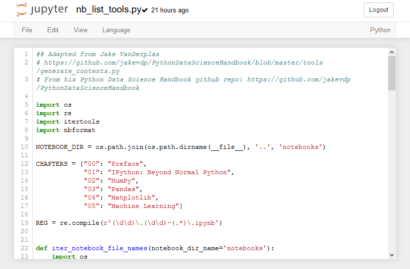

## The Jupyter Notebook Interface

When a new notebook opens, you will see the Jupter Notebook interface. Accross the top of the notebook will the the Jupyter icon and the Notebook name. You can click in the notebook name field and change the name of the notebook. Note that the file extension ```.ipynb``` is not printed in the file name field, but if you look in the Home tab, you will see that the notebook is saved with the ```.ipynb``` extension.
### Menus and Buttons

A jupyter notebook is comprised of a bunch of cells which are arrayed one after another in boxes below the menu items and buttons. There are two main types of cells: Markdown cells and Code cells.
### Code Cells

In code cells you can write Python Code, then execute the code and see the resulting output. An example of a code cell is shown below. Note that the code cell has an the text ```In[ ]``` to the left of it. In the top menu, the cell type drop down will read [Code] when you are editing a code cell.

To run the code in a code cell push the [Run] button or type [Shift]+[Enter]. Hitting [Enter] when inside a code cell will only bring the curor down to a new line.
###  Markdown Cells

In markdown cells you can type in markdown which will be richly formatted when "run". Markdown cells are used for documentation and explaining your code. An example of a markdown cell is shown below. The text in a markdown cell is not executed like code cells are executed. In the top menu, the cell type drop down will read [Markdown] when you are editing a markdown cell. Markdown cells can be formatted with a few special characters. To "run" a markdown cell push the [Run] button or type [Shift]+[Enter]. Hitting [Enter] when inside a markdown cell will only bring the curor down to a new line.

Markdown syntax includes the availability of writting headings, bold, itallics, code blocks and tables.

#### Headings

```# H1 Heading```

# H1 Heading
 
```## H2 Heading```

## H2 Heading
 
```### H3 Heading```

### H3 Heading
 
 
```#### H4 Heading```

#### H4 Heading
 
<br>

#### Bold and Itallic Text

**Bold text** and _itallic text_ can be written in markdown using the double asterisk ```**``` and the underscore ```_```

Surround bold text with double asterisks ``**``. Make sure two asterists is used (one asterix will produce itallics).

```
**Bold Text**
```

Will result in:

**Bold Text**

Surround itallic text with the underscore ```_``` character:

```
_itallic text_
```

Will result in

_itallic text_

#### Code Blocks

Inline code blocks (use the \` left qutoe character, the character to the left of one, and above tab on most keyboards)
 
\`\`\` ```Inline code blocks``` \`\`\`
 

<br>
 
\`\`\`
  
Seperated code blocks
  
\`\`\`
  
```
Seperated code blocks
```

#### Tables

Tables can be formated in markdown cells with the pipe character  ```|```. The table header row needs to have ```|``` where you want vertical lines. The second line of a table needs the structure ```| --- | --- |```. All subsequent rows of the table need pipes between cells.

```
| Col 1 Header | Col 2 Header |
| --- | --- |
| row 1 col 1 | row 1 col 2 |
| row 2 col 1 | row 2 col 2|
```

will result in:

| Col 1 Header | Col 2 Header |
| --- | --- |
| row 1 col 1 | row 1 col 2 |
| row 2 col 1 | row 2 col 2|
### Saving Jupyter Notebooks in Other Formats

Jupyter notebooks can be saved in other formats besides the native ```.ipynb``` format. These formats can be acceed on the [File] --> [Download As] menu.


The available file types are:

 * Notebook (.ipynb) - The native jupyter notebook format
 * Python (.py) - The native Python code file format.
 * HTML (.html) - A web page
 * Markdown (.md) - Markdown format
 * reST (.rst) - Restructured text format
 * LaTeX (.tex) - LaTeX format
 * PDF via LaTeX - a pdf exported from LeTeX, requires a converter
 
When a Notebook is saved as a ```.py``` file, any text in Mardown Cells are converted to commments, and any code cells are kept as Python code. 


The ```.py``` file after this notebook is ```Downloaded as``` a ```Python(.py)``` looks like:


 

