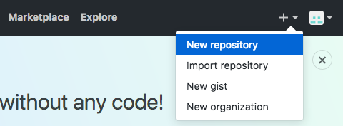
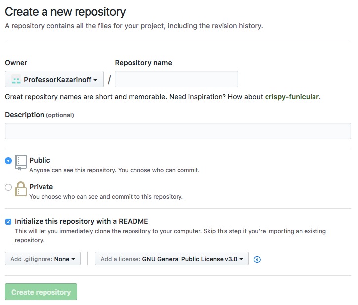

## Git and GitHub
**Git** is a common version control tool used by computer program developers to save code, track code and work on code as a team. **Git** is a program run from the command line or **Anaconda Prompt**.
**github.com** is a website and service used by open source projects to share code and allow other users to make changes to exhisting code.
Both **git** and **github.com** are useful for problem solvers working in teams.
To use **git** and **github** it is helpful to understanding a few key terms:

 * **git** - a command line program used to track file changes and collaborate building code with others
 * **repo** - short name for "repository". A repo is a directory that contains files and possibly subdirectories with files
 * **local repo** -  a directory that contains files and subdirectories on your computer that git knows about
 * **remote repo** - a set of files and subdirectories stored in the cloud, often on github.com, that git knows about
The useful git commands are summarized below:

| command | description |
| --- | --- |
| ```git init``` | initialize a new repository |
| ```git remote add origin https://github.com/username/reponame.git`` | links a local git repo with a remote git repo on github.com |
| ```git add .``` | adds all the files and changes to the local git repo |
| ```git commit -m "commit message"``` | commits the changes in the local repo |
| ```git push origin master``` | pushes the changes up to the remote repo on github.com |
| ```git pull origin master``` | pulls the version in the remote repo down to the local repo |
| ```git clone https://github.com/username/reponame.git``` | copies a remote repo on github.com to a local directory |

To use github.com and git to mange a project, there are three basic steps:

1. create an account on github.com
2. create a remote repo on github.com
3. create a project directory locally and link to the remote repo. 
4. Sych the local repo with the remote repo.
    
    
### Create a github.com account
To sign up for a github.com account go here:

[https://github.com/join](https://github.com/join)

The account activation screen looks something like:


### Create a remote repo on github.com
Once your github.com account is set up, log in and create a new repository. Use the + button on the upper right-hand menu:



Name the new repository. It's recommend to included both a **README.md** and a license. **GNU General Public License v3.0** and **MIT License** are good options. It is also a good idea to add a ```.gitignore``` file. This ```.gitignore``` file lists the folders and files that will be ignored by git. It is recommended that you scroll down and select the **Python** .gitignore template


### Make a project directory and link it to github
Once the github repo (short for repository, basically a folder with files on github.com) is set up, the last step to complete the development environment is to link the remote repo on github to the local version of the site on the local computer. 

The local version is in a folder called ```project``` in the ```Documents``` folder.

```text
$ cd ~
$ cd Documents
$ mkdir project
$ cd project
```

We can set up git to keep the contents of the local ```project``` folder in sync with the contents of the remote repo on github.com. The command ```git init``` will initiate or create the local repository. The command ```git remote add origin``` followed by the url of our github repo links local directory to the remote repo on github. Note the web address ends in ```.git```. If you are following along and want to build your own static site, make sure to change ```username``` to your github username and ```reponame``` to your github repo name.

```text
$ git init
$ git remote add origin https://github.com/username/reponame.git
```

On github.com we have a README.md file and a  license. But the local project folder on the computer is empty. So the two repos are out of sync. To make the contents of each folder identical, we **_pull_** the files from github.com onto the local computer. A **_pull_** "pulls" or gets the files from github.com and copies them to the local project folder.

```
$ git pull origin master
```

If you look in the local project folder you should now see the following two files:

```
project
├── .gitignore
├── LICENSE
├── README.md
```

Now each time you work on the project, navigate to the **project** folder on the local computer. Before any editing, key in the command:

```
$ git pull origin master
```

After the _pull_, the project folder is up-to-date with the newest version of all the files on github.com. 

Then go about editing files, adding files, deleting files, etc. 

After the edits, the last thing to do before shutting down the computer for the day is add all the changes to git with ```git add .``` (note there is a space between the ```add``` and the period ```.```). Then commit those changes locally with the line ```git commit -m "commit message"``` (note the double quotes ```"commit message"``` used around the commit message), and finally push the changes up to github.com with ```git push origin master```. Now the version of the site up on github.com is the same as the version of the project on the local machine.

```
git add .
git commit -m "commit message"
git push origin master
```

This ensures the project directory on the local computer and the github.com repo contain the same version of the project.
 

